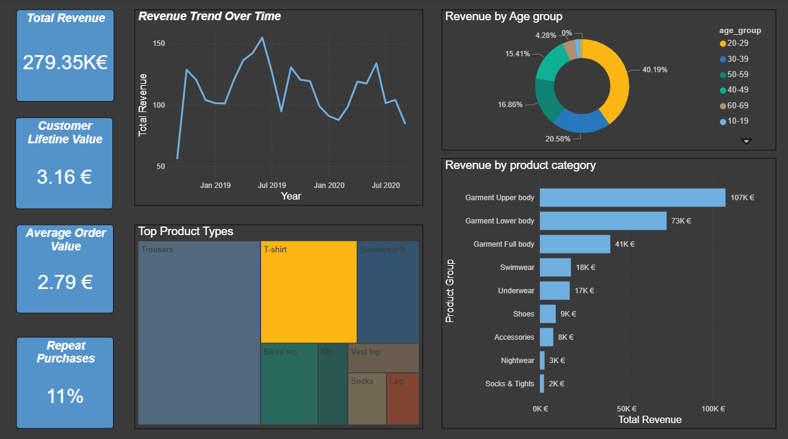

# HM Retail Sales Analytics Dashboard

## Project Overview

This project analyzes retail transaction data from the **H&M Personalized Fashion Recommendations dataset** to understand customer behavior, product performance, and sales trends.  
The objective is to derive actionable business insights through **SQL-based data analysis** and build an **interactive Power BI dashboard** to visualize key retail metrics.  

The project demonstrates skills in **data cleaning, exploratory data analysis (EDA), KPI development, and data visualization**.  

---

## Tools & Technologies  

* **PostgreSQL** – Data storage, querying, and aggregation  
* **SQL** – Data cleaning, transformations, and KPI analysis  
* **Power BI** – Dashboard creation and data visualization  

---

## Dataset

The analysis uses the **H&M Personalized Fashion Recommendations dataset** available on Kaggle.
The dataset contains information about:

* Customer demographics
* Product catalog
* Transaction history
* Purchase behavior over time

---

## Data Preparation

The following steps were performed during data preparation:

1. Imported raw CSV datasets into **PostgreSQL**.
2. Cleaned missing values in customer attributes.
3. Created structured analytical tables for easier analysis.
4. Built a **master analytical dataset (`sales_analysis`)** by joining:

   * `customers`
   * `transactions`
   * `articles`
5. Created **aggregated SQL views** to support dashboard visualizations.

---

## Key KPIs

The dashboard focuses on the following business metrics:

* **Total Revenue**
* **Average Order Value (AOV)**
* **Customer Lifetime Value (CLV)**
* **Repeat Purchase Rate**

These KPIs provide insights into overall business performance and customer value.

---

## Dashboard Visualizations

The Power BI dashboard includes:

* **Revenue Trend Over Time** – Identifies sales patterns and seasonality.
* **Revenue by Product Category** – Highlights the most profitable product groups.
* **Customer Revenue by Age Segment** – Shows which age groups contribute most to sales.
* **Top Product Types** – Displays the most popular items based on purchases.

---

## Key Business Insights

Some insights derived from the analysis include:

* Customers aged **20–29 contribute the largest share of total revenue**.
* **Garment Upper Body products** generate the highest revenue among product categories.
* Revenue shows **seasonal fluctuations**, with peaks occurring during mid-year periods.
* The **repeat purchase rate is approximately 11%**, indicating moderate customer retention.

---

## Dashboard Preview

